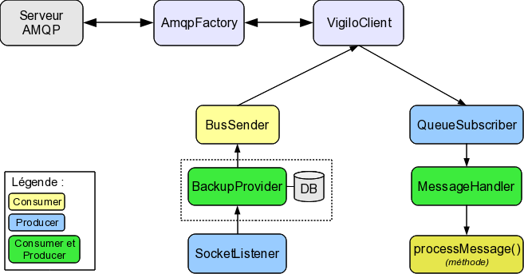

******************
Manuel développeur
******************

Contenu du module
=================

Le module :py:mod:`vigilo.connector` contient les fichiers suivants :

:file:`amqp.py`
    Classes et méthodes spécifiques au protocole AMQP, et indépendantes de
    Vigilo.

:file:`configure.py`
    Script de configuration du bus (``vigilo-bus-config``).

:file:`interfaces.py`
    Interfaces (au sens `zope.interface`) pour les composants d'un connecteur
    Vigilo.

:file:`serialize.py`
    Fonctions de conversion entre un message textuel tel qu'envoyé par Nagios
    et un dictionnaire de données tel qu'il sera envoyé sur le bus.

:file:`store.py`
    Classes permettant d'instancier une base de données SQLite pour stocker les
    messages en attente.

:file:`client.py`
    Classes principales pour la gestion de la connexion au bus AMQP. Pour plus
    d'information, voir la documentation concernant le :ref:`dev_client.py`.

:file:`handlers.py`
    Classes spécifiques à la gestion d'un aspect d'un connecteur AMQP. Pour plus
    d'information, voir la documentation concernant le :ref:`dev_handlers.py`.

:file:`ipv6.py`
    Classe et méthode pour ajouter une meilleure gestion d'IPv6 à Twisted
    (par *monkey-patching*).

:file:`socket.py`
    Classe et fonction d'instanciation pour la gestion d'un socket UNIX de
    communication.

:file:`conffile.py`
    Classe permettant l'accès à un fichier ou une base SQLite de configuration
    télédistribuée par VigiConf, avec gestion du rechargement sur signal ou
    mise à jour du fichier.

:file:`options.py`
    Classe et options permettant de factoriser la gestion des options en ligne
    de commande, et de certaines options du fichier ``settings.ini``.

:file:`status.py`
    Classe et fonction d'instanciation (*factory*) pour l'envoi des messages
    d'état des connecteurs sur le bus, avec leurs données de performance.

..  _`dev_client.py`:

Contenu du module :py:mod:`client`
----------------------------------

La classe :py:class:`VigiloClient` correspond à un client classique qui reste
connecté, et la classe :py:class:`OneShotClient` correspond à un client qui
se déconnecte et s'arrête après avoir exécuté sa tâche.

Ce module contient aussi les fonctions *factories* pour l'instanciation de ces
classes en fonction d'un fichier de *settings*.

:py:class:`VigiloClient`
^^^^^^^^^^^^^^^^^^^^^^^^
La classe :py:class:`VigiloClient` est implémentée sous la forme de
`services Twisted`_, elle gère :

- le choix du serveur AMQP auquel se connecter (possibilité d'en spécifier
  plusieurs dans un cas de haute disponibilité) ;
- l'envoi des messages sur le bus par la méthode :py:meth:`send` ;
- l'abonnement de *handlers* aux évènements tels que le démarrage, l'arrêt et
  la connexion au bus, et la diffusion de ces évènements lorsqu'ils
  surviennent.

La méthode :py:meth:`send` permet de demander l'envoi d'un message sur le bus,
qui sera mis en attente si la connexion n'est pas encore établie. Régler
l'option ``persistent`` à ``False`` si on veut que le message soit transitoire,
c'est-à-dire qu'il ne soit pas conservé sur le bus en cas de non-connexion du
ou des destinataires (cas du ``connector-vigiconf`` pour la haute
disponibilité).

Le mécanisme des *handlers* est décrit dans la section :ref:`dev_handlers.py`.

On peut instancier un :py:class:`VigiloClient` grâce à la méthode
:py:func:`vigiloclient_factory`, qui prend en argument un fichier de
*settings*.

:py:class:`OneShotClient`
^^^^^^^^^^^^^^^^^^^^^^^^^
La classe :py:class:`OneShotClient` permet de créer un client à usage unique,
c'est-à-dire qu'il se connecte au bus au démarrage, effectue son traitement, se
déconnecte et s'arrête.

Après instanciation de cette classe, il faut enregistrer une fonction de
traitement avec la méthode :py:meth:`setHandler`, puis lancer la méthode
:py:meth:`run`. La classe se déconnectera et arrêtera le *reactor* quand le
traitement aura été effectué.

On peut instancier un :py:class:`OneShotClient` grâce à la méthode
:py:func:`oneshotclient_factory`, qui prend en argument un fichier de
*settings*.

..  _`dev_handlers.py`:

Contenu du module :py:mod:`handlers`
------------------------------------

Les handlers sont des classes qui implémentent l'interface
:py:class:`IBusHandler` disponible dans le module py:module:`interfaces`.
Ils disposent d'une référence à l'instance de :py:class:`VigiloClient` sous la
forme de l'attribut ``client``.

Les évènements suivants sont propagés à un *handler* enregistré auprès d'un
client :

- :py:meth:`startService`: démarrage du client.
- :py:meth:`stopService`: arrêt du client.
- :py:meth:`connectionInitialized`: connexion au bus établie.
- :py:meth:`connectionLost`: connexion au bus perdue.

Les *handlers* fournis par le module :py:mod:`handlers` sont décrits
ci-dessous.

:py:class:`QueueSubscriber`
^^^^^^^^^^^^^^^^^^^^^^^^^^^
Classe permettant de s'abonner à une file d'attente, et fonctionnant comme un
``PullProducer`` : un appel à :py:meth:`resumeProducing` ne permet de recevoir
qu'un seul message. La méthode en elle-même ne retourne aucune valeur, mais
elle utilise un |Deferred|_ retourné par la file d'attente pour appeler
automatiquement la méthode :py:meth:`write` du consommateur
(:py:class:`MessageHandler`) lorsqu'un message est effectivement mis
en attente.

Cette classe ne s'instancie généralement pas directement, on préfèrera utiliser
la classe :py:class:`MessageHandler`.

:py:class:`MessageHandler`
^^^^^^^^^^^^^^^^^^^^^^^^^^
Classe permettant de gérer la réception des messages depuis le bus. Elle
instancie :py:class:`QueueSubscriber` par l'appel à la méthode
:py:meth:`subscribe`, reçoit les messages qui en proviennent et les décode sous
la forme d'un dictionnaire.

Les messages sont passés à la méthode :py:meth:`processMessage` qui doit être
ré-implémentée par les sous-classes, et suivant le résultat de ce traitement
le message est acquitté ou rejeté, puis le message suivant est demandé.

Cette classe est donc systématiquement dérivée pour effectuer le traitement
voulu, ce mode de fonctionnement pourra être amélioré à l'avenir pour
transférer les messages à un objet dédié plutôt que de fonctionner par
héritage.

:py:class:`BusPublisher`
^^^^^^^^^^^^^^^^^^^^^^^^
Classe permettant de gérer la publication des messages sur le bus.

Elle agit en tant que consommatrice (:py:class:`Consumer`) d'un producteur
de tout type (:py:class:`PushProducer` ou :py:class:`PullProducer`)
et demandera le message suivant à envoyer en fonction de ce type.

Le message reçu est un dictionnaire, dont certaines clés sont utilisées pour
déterminer la persistance et la clé de routage du message. Cette classe est
aussi capable d'accumuler les messages de performance pour limiter le nombre de
messages publiés.

La classe :py:class:`BusPublisher` peut être instanciée par la fonction
:py:func:`buspublisher_factory` qui prend en argument le fichier *settings*
dans lequel les options sont spécifiées.

:py:class:`BackupProvider`
^^^^^^^^^^^^^^^^^^^^^^^^^^
Classe fournissant un système de tampon avec persistance sur disque entre un
producteur de type :py:class:`PushProducer` (dont on ne contrôle pas le débit)
et un consommateur. Elle ajoute à ce producteur la possibilité d'être mis
en pause, auquel cas les données sont envoyées dans une file d'attente
qui est sauvegardée sur le disque dans une base SQLite.
La classe de gestion de la base SQLite est :py:class:`store.DbRetry`.

L'utilisation typique de cette classe est pour fournir un tampon dans le
``connector-nagios`` entre les messages envoyés par Nagios et le bus (le
connecteur pouvant perdre sa connexion).

La classe :py:class:`BackupProvider` peut être instanciée par la fonction
:py:func:`backupprovider_factory` qui prend en argument le fichier *settings*
dans lequel les options sont spécifiées.

Utilisation des classes
=======================

Par convention, le plugin `twistd`_ d'un connecteur ne contient que l'appel à
une fonction :py:func:`makeService` définie à la racine du module principal du
connecteur (dans son fichier :file:`__init__.py`).

Pour des exemples, se référer au fichier :file:`src/twisted/vigilo_nagios.py`
dans les sources du ``connector-nagios`` et à la fonction
:py:func:`vigilo.connector_nagios.makeService` pour l'instanciation des
classes.

    Circulation des messages entre les classes utilisées dans un connecteur
    Vigilo.

..  _`services Twisted`:
    http://twistedmatrix.com/documents/current/core/howto/application.html
..  |Deferred| replace:: :py:class:`Deferred`
..  _`Deferred`:
    http://twistedmatrix.com/documents/current/core/howto/defer.html
..  _`twistd`:
    http://twistedmatrix.com/documents/current/core/howto/tap.html

.. vim: set tw=79 :
